# hqWidgets für vis-2

Die hqWidgets sind zehn Widgets für Schalter, Dimmer, Thermostate, Fenster, Türen und Zähler. Diese Seite beschreibt
die Version für **vis-2**. vis (vis-1) hat dieselben Widgets mit denselben Einstellungen, dort sehen sie aber etwas
anders aus.

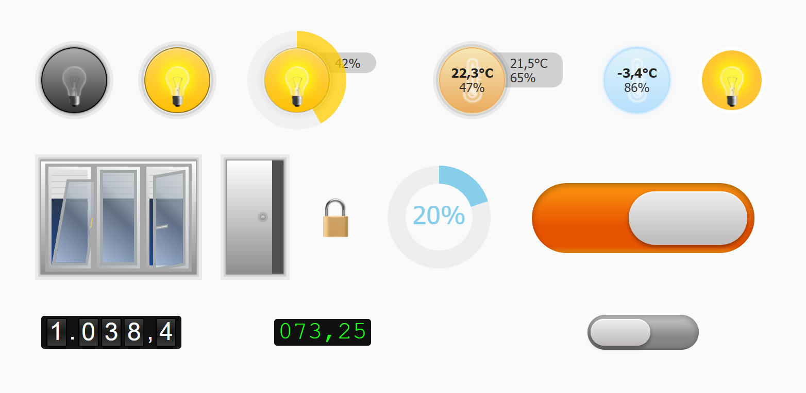

**Inhalt**

- [Allgemeines](#allgemeines)
    - [Voraussetzungen und Migration](#voraussetzungen-und-migration)
    - [Werte im Editor](#werte-im-editor)
    - [Beschreibungen](#beschreibungen)
    - [Indikatoren](#indikatoren)
    - [Stile und Änderungseffekte](#stile-und-änderungseffekte)
    - [Dunkles Design](#dunkles-design)
    - [Gemeinsame Einstellungen der runden Widgets](#gemeinsame-einstellungen-der-runden-widgets)
- [An/Aus](#anaus---tplhqbutton)
- [Dimmer](#dimmer---tplhqdimmer)
- [Innentemperatur](#innentemperatur---tplhqintemp)
- [Außentemperatur](#außentemperatur---tplhqouttemp)
- [Fenster und Rollladen](#fenster-und-rollladen---tplhqshutter)
- [Tür](#tür---tplhqdoor)
- [Schloss](#schloss---tplhqlock)
- [Schalter](#schalter---tplhqcheckbox)
- [Drehregler](#drehregler---tplhqcircle)
- [Zählwerk](#zählwerk---tplhqodometer)
- [Unterschiede zu vis-1](#unterschiede-zu-vis-1)

## Allgemeines

### Voraussetzungen und Migration

Die Widgets stehen im vis-2-Editor in der Widget-Liste unter dem Satz **hqWidgets**. Die hier beschriebenen
React-Versionen brauchen **vis-2 2.12.8** oder neuer. Ältere vis-2-Versionen zeigen stattdessen die vis-1-Widgets.

Projekte aus vis-1 funktionieren ohne Änderungen weiter. Beide Versionen verwenden dieselben Widget-IDs
(`tplHqButton`, `tplHqDimmer`, ...) und dieselben Attributnamen, und vis-2 nimmt automatisch die React-Version. Alle
Einstellungen bleiben erhalten.

In den Tabellen unten ist **Einstellung** die Beschriftung im vis-2-Editor und **Attribut** der Name, unter dem der
Wert im Projekt gespeichert wird. Den Attributnamen brauchen Sie, wenn Sie ein Projekt als JSON bearbeiten oder
Einstellungen zwischen Widgets kopieren.

### Werte im Editor

Manche Einstellungen enthalten einen Wert, der in einen Datenpunkt geschrieben wird, zum Beispiel *Aus-Wert* und
*An-Wert* beim An/Aus-Widget oder *Zu-Wert* beim Schloss. Der Editor speichert sie als Text, und das Widget wandelt
den Text so um:

| Eingegebener Text     | Wird geschrieben als |
|-----------------------|----------------------|
| `true` / `false`      | Boolean `true` / `false` |
| `0`, `1`, `42.5`, ... | Zahl                 |
| alles andere          | der Text unverändert |
| (leer)                | der Standardwert der Einstellung |

### Beschreibungen

Die runden Widgets, das Fenster, die Tür und das Schloss können links neben dem Widget eine Beschriftung zeigen. Die
runden Widgets können auch rechts eine zeigen. Die rechte Beschriftung der runden Widgets zeigt den Wert, einen
eigenen Text, die Ventilstellung und die Zeit der letzten Änderung. Das dritte Widget im Bild zu
[An/Aus](#anaus---tplhqbutton) zeigt beide Beschriftungen.

| Einstellung | Attribut | Standard | Beschreibung |
|---|---|---|---|
| Keine Beschreibung (links) | `descriptionLeftDisabled` | aus | Blendet die linke Beschriftung aus. |
| Beschreibung (links) | `descriptionLeft` | | Text der linken Beschriftung. `\n` beginnt eine neue Zeile. Von selbst bricht der Text nicht um. |
| Schriftgröße links | `infoLeftFontSize` | 12 | Schriftgröße links in px. |
| Beschreibung (rechts) | `infoRight` | | Text der rechten Beschriftung (nur An/Aus). |
| Schriftgröße rechts | `infoFontRightSize` | 12 | Schriftgröße rechts in px. |
| Textfarbe | `infoColor` | | Textfarbe beider Beschriftungen. Leer folgt dem Design. |
| Hintergrund | `infoBackground` | | Hintergrund beider Beschriftungen. Leer folgt dem Design. |
| Linker Abstand (Links) / Rechter Abstand (Links) | `infoLeftPaddingLeft` / `infoLeftPaddingRight` | 15 / 50 | Innenabstände der linken Beschriftung in px. Der rechte Abstand liegt unter dem Widget. |
| Linker Abstand (Rechts) / Rechter Abstand (Rechts) | `infoRightPaddingLeft` / `infoRightPaddingRight` | 0 / 15 (Fenster: 15 / 15) | Innenabstände der rechten Beschriftung in px. Der linke Abstand kommt zur halben Widgetbreite dazu. |

Die runden Widgets können außerdem zeigen, wann sich der Datenpunkt zuletzt geändert hat:

| Einstellung | Attribut | Standard | Beschreibung |
|---|---|---|---|
| Letzte Änderung ausblenden nach (Std.) | `hoursLastAction` | | Leer: keine Zeitangabe. Eine Zahl schaltet die Zeile ein. Mit *Zeit als Intervall* verschwindet sie, sobald die Änderung älter als so viele Stunden ist. |
| Zeit als Intervall | `timeAsInterval` | an | Relative Zeit: *gerade jetzt*, *vor 5 Min.*, *vor 2 St. und 10 Min.*, *gestern*. Wird jede Minute aktualisiert. |
| Datumsformat | `format_date` | | Gilt, wenn *Zeit als Intervall* aus ist: `YYYY.MM.DD hh:mm:ss`, `DD.MM.YYYY hh:mm:ss`, `YYYY/MM/DD hh:mm:ss`, `hh:mm:ss` oder `hh:mm`. Leer bedeutet `DD.MM.YYYY hh:mm:ss`. |

### Indikatoren

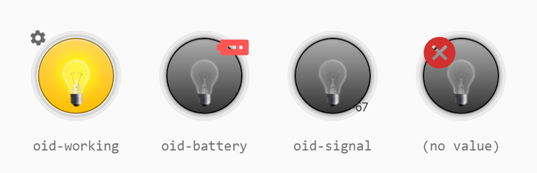

Kleine Symbole über dem Widget melden Probleme. Im Bild von links nach rechts:

- **In Arbeit** (Zahnrad, oben links) - der Datenpunkt in *Objekt-ID "in Arbeit"* ist `true`. Ohne diesen
  Datenpunkt erscheint das Zahnrad, solange das Gerät den Wert des Widgets noch nicht bestätigt hat (`ack = false`).
  Nach dem Schalten sieht man es also, bis der Adapter den neuen Wert bestätigt.
- **Batterie** (oben rechts) - der Datenpunkt in *Batterie-Objekt-ID* ist `true`.
- **Signal** (unten rechts) - der Wert der *Signal-Objekt-ID* wird als Text angezeigt, zum Beispiel die
  Signalstärke.
- **Kein Wert** (rotes Kreuz) - der Datenpunkt in *Objekt-ID* hat noch keinen Wert.

Nicht jedes Widget bietet alle Indikatoren. Welche es gibt, steht in den Tabellen der Widgets.

### Stile und Änderungseffekte

Die runden Widgets und das Schloss zeichnen ihre Oberfläche mit einer der unten gezeigten Vorlagen. *Normal* gilt,
solange das Widget aus ist, *Aktiv*, solange es an ist. Die Temperatur-Widgets haben keinen *Aktiv*-Stil.

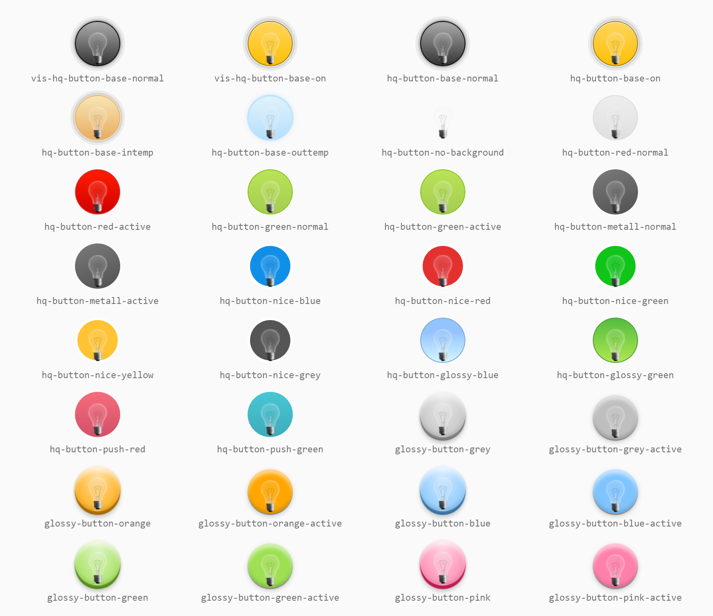

| Einstellung | Attribut | Beschreibung |
|---|---|---|
| Normal | `styleNormal` | Stil im ausgeschalteten Zustand (siehe Bild). |
| Aktiv | `styleActive` | Stil im eingeschalteten Zustand. |
| jQuery Stil anwenden | `usejQueryStyle` | Verwendet statt der Stile die Klassen `ui-state-default` / `ui-state-active` eines jQuery-UI-Themes. Das wirkt nur, wenn das Projekt ein solches Theme lädt. |
| Änderungseffekt | `changeEffect` | Animation, wenn sich der Wert von außen ändert, zum Beispiel wenn das Licht am Wandschalter geschaltet wird. Bei den runden Widgets lösen Klicks im Widget selbst sie nicht aus. Möglich sind `waves`, `wobble`, `tada`, `swing`, `shake`, `rubberBand`, `pulse`, `flash`, `bounce`. |
| Wellenfarbe | `waveColor` | Farbe der Ringe beim Effekt `waves`. Standard: grau. |
| Test | `testActive` | Nur im Editor: zeigt das Widget im jeweils anderen Zustand. So lässt sich der *Aktiv*-Stil prüfen, ohne das Gerät zu schalten. |

### Dunkles Design

Im dunklen Design von vis-2 ändert sich die Farbe von allem, was auf der View liegt: die Beschriftungen, die Spur des
Rings, der Signaltext und die Popups von Fenster und Schloss. Die Widgets selbst behalten in beiden Designs ihre
Farben, weil sie echte Gegenstände darstellen. Eine eingeschaltete Lampe bleibt auch nachts gelb.

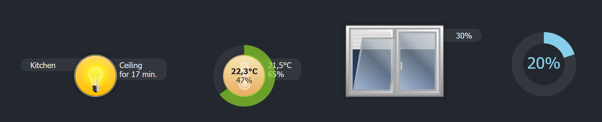

### Gemeinsame Einstellungen der runden Widgets

An/Aus, Dimmer, Innentemperatur und Außentemperatur bauen auf demselben runden Knopf auf. Sie teilen sich diese
Gruppen. Bei den einzelnen Widgets steht unten nur, was abweicht.

**Gruppe "Zentrum"** - Inhalt in der Mitte des Knopfes

| Einstellung | Attribut | Standard | Beschreibung |
|---|---|---|---|
| Beschriftung | `caption` | | Text in der Mitte. Ist das Widget höher als breit, steht der Text unter dem Bild, sonst daneben. |
| Beschriftung bei aktiv | `captionOn` | | Text im eingeschalteten Zustand (nur An/Aus). Leer behält die *Beschriftung*. |
| Kleinbild | `iconName` | je nach Widget | Bild in der Mitte. |
| Aktivbild | `iconOn` | | Bild im eingeschalteten Zustand. Leer behält das *Kleinbild*. Die Temperatur-Widgets sind nie eingeschaltet, dort wirkt es nicht. |
| Bildbreite | `btIconWidth` | 56 / 45 | Größe des Bildes in px. |
| Automatisch positionieren | `offsetAuto` | an | Zentriert Bild und Beschriftung. |
| Offset links / Offset von Oben | `leftOffset` / `topOffset` | 15 / 55 | Position in Prozent der Widgetgröße, wenn *Automatisch positionieren* aus ist. |
| Kreisbreite | `circleWidth` | 50 | Größe des Rings in Prozent **zusätzlich** zur Widgetbreite: 50 macht den Ring 1,5-mal so breit wie das Widget. Nur Dimmer und Innentemperatur. |
| Wert anzeigen | `showValue` | an | Zeigt den Wert im Ring, solange der Zeiger über dem Widget ist. |
| Kreis immer zeigen | `alwaysShow` | aus | Zeigt den Ring immer, nicht nur, solange der Zeiger über dem Widget ist. |
| Textfarbe Mitte | `midTextColor` | | Farbe von Temperatur und Luftfeuchtigkeit in der Mitte (Temperatur-Widgets). |

**Gruppe "Grafik"** - nur Innen- und Außentemperatur. Ein Klick öffnet eine Webseite, meist ein Diagramm der
Temperatur, in einem Dialog über der View.

| Einstellung | Attribut | Standard | Beschreibung |
|---|---|---|---|
| URL | `url` | | Adresse der Seite, zum Beispiel ein Link auf ein Diagramm des *flot*- oder *echarts*-Adapters. Leer: kein Dialog. |
| Dialogtitel | `dialog_title` | | Name der eingebetteten Seite. Der Dialog in vis-2 hat keine Titelzeile. |
| Dialogbreite / Dialoghöhe | `dialog_width` / `dialog_height` | 600 / 400 | Größe in px. |
| Modaler Dialog | `dialog_modal` | aus | Dunkelt die View hinter dem Dialog ab. |
| Zumachen nach (ms) | `dialog_timeout` | | Schließt den Dialog nach so vielen Millisekunden. Leer oder 0: bleibt offen. |
| Testen | `dialog_open` | aus | Öffnet den Dialog im Editor, um Größe und URL zu prüfen. |

Ein Klick neben den Dialog schließt ihn.

## An/Aus - `tplHqButton`

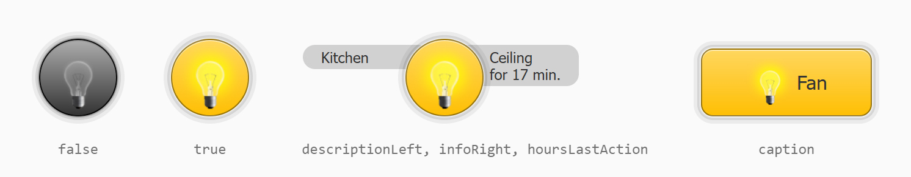

Ein runder Knopf für einen Schalter oder eine Lampe. Ein Klick wechselt zwischen *Aus-Wert* und *An-Wert*. Im Bild
von links nach rechts: aus, an, an mit beiden Beschriftungen und der Zeit der letzten Änderung, und ein eckiges Widget
mit Beschriftung. Die Form kommt aus dem Stil des Widgets. Der Standard `border-radius: 64px` macht es rund. Für ein
Rechteck entfernen oder verkleinern Sie ihn.

**Bedienung**

- Das Widget ist *an*, solange der Datenpunkt gleich dem *An-Wert* ist, sonst *aus*. Verglichen wird locker, die Zahl
  `1` passt also auch zu `true`.
- **Taster**: Drücken schreibt den *An-Wert*, Loslassen den *Aus-Wert*. Das funktioniert auch, wenn der Zeiger neben
  dem Knopf losgelassen wird. Gedacht für Türöffner und Klingeln.
- **Nur lesend**: zeigt den Zustand an, reagiert aber nicht auf Klicks.
- Im Editor reagiert das Widget nicht auf Klicks.

| Einstellung | Attribut | Standard | Beschreibung |
|---|---|---|---|
| Objekt-ID | `oid` | | Der Datenpunkt, der geschaltet wird. |
| Objekt-ID "in Arbeit" | `oid-working` | | Siehe [Indikatoren](#indikatoren). |
| Batterie-Objekt-ID | `oid-battery` | | Siehe [Indikatoren](#indikatoren). |
| Signal-Objekt-ID | `oid-signal` | | Siehe [Indikatoren](#indikatoren). |
| Nur lesend | `readOnly` | aus | Nur Anzeige. |
| Aus-Wert | `min` | `false` | Wird beim Ausschalten geschrieben. |
| An-Wert | `max` | `true` | Wird beim Einschalten geschrieben. |
| Taster | `pushButton` | aus | Schreibt den *An-Wert*, solange gedrückt wird, und den *Aus-Wert* beim Loslassen. |

Gruppen *Zentrum* (Standardbild `img/bulb_off.png`), *Beschreibungen* und *Stil* (Standard
`vis-hq-button-base-normal` / `vis-hq-button-base-on`): siehe [Allgemeines](#allgemeines).

**Gruppe "Zusätzliche Steuerung"** - weitere Aktionen bei jedem Schalten:

| Einstellung | Attribut | Beschreibung |
|---|---|---|
| URL für AN / URL für AUS | `urlTrue` / `urlFalse` | Wird beim Ein- / Ausschalten aufgerufen. Ohne *URL für AUS* wird beide Male *URL für AN* aufgerufen. |
| Objekt-ID für AN / Objekt-ID für AUS | `oidTrue` / `oidFalse` | Ein weiterer Datenpunkt, der beim Ein- / Ausschalten geschrieben wird. Ohne *Objekt-ID für AUS* bekommt *Objekt-ID für AN* beide Werte. |
| Wert für AN / Wert für AUS | `oidTrueValue` / `oidFalseValue` | Die Werte für diese Datenpunkte. Leer: *An-Wert* / *Aus-Wert*. |

Die zusätzlichen Aktionen funktionieren auch ohne *Objekt-ID*. Der Knopf ruft dann nur die URLs auf oder schreibt die
anderen Datenpunkte.

## Dimmer - `tplHqDimmer`

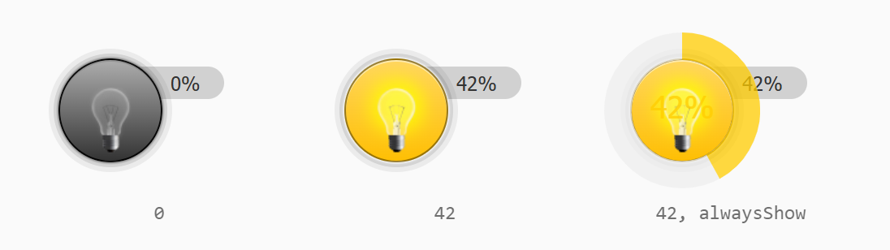

Ein runder Knopf mit einem Ring für einen Wert von *Minimum* bis *Maximum*, typischerweise die Helligkeit einer Lampe.
Der Ring erscheint, solange der Zeiger über dem Widget ist, oder immer mit *Kreis immer zeigen*. Im Bild: 0 %, 42 % und
42 % mit sichtbarem Ring.

**Bedienung**

- Am Ring **ziehen** stellt den Wert ein. Er wird beim Loslassen geschrieben.
- Kurz auf den Ring **tippen** (unter 300 ms, ohne Bewegung) schaltet. Über 5 % des Bereichs schaltet es auf das
  *Minimum*, sonst auf das *Maximum*. Mit *Wert beim Klick* schaltet ein Tippen immer aus, wenn der Wert über dem
  *Minimum* liegt, und setzt sonst diesen Wert.
- Die rechte Beschriftung zeigt den Wert mit Einheit. Das Widget verwendet den *Aktiv*-Stil, solange der Wert über dem
  *Minimum* liegt.

| Einstellung | Attribut | Standard | Beschreibung |
|---|---|---|---|
| Objekt-ID | `oid` | | Der Datenpunkt für den Wert, z. B. `level.dimmer`. |
| Objekt-ID "in Arbeit" / Batterie- / Signal-Objekt-ID | `oid-working` / `oid-battery` / `oid-signal` | | Siehe [Indikatoren](#indikatoren). |
| Nur lesend | `readOnly` | aus | Zeigt den Ring, ändert den Wert aber nicht. |
| Einheit | `unit` | `%` | Wird an den Wert angehängt. |
| Minimum / Maximum | `min` / `max` | 0 / 100 | Wertebereich des Datenpunkts. |
| Nachkommastellen | `digits` | 0 | Nachkommastellen des angezeigten und geschriebenen Werts. |
| Schritt | `step` | 1 | Schrittweite des Rings. |
| Komma als Dezimaltrennzeichen | `is_comma` | an | `42,5` statt `42.5`. |
| Wert beim Klick | `set_by_click` | | Wert für ein Tippen im ausgeschalteten Zustand, z. B. 70 für eine angenehme Helligkeit statt vollem Licht. |

Gruppen *Zentrum* (mit den Einstellungen des Rings, Standardbild `img/bulb_off.png`), *Beschreibungen* (ohne rechten
Text) und *Stil*: siehe [Allgemeines](#allgemeines).

## Innentemperatur - `tplHqInTemp`

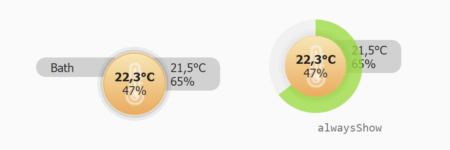

Ein Thermostat für einen Raum. In der Mitte stehen die gemessene Temperatur (fett) und die Luftfeuchtigkeit. Die
rechte Beschriftung zeigt Solltemperatur und Ventilstellung. Mit dem Ring stellt man die Solltemperatur ein.

Die Farbe des Rings geht von Blau beim *Minimum* bis Rot beim *Maximum*:

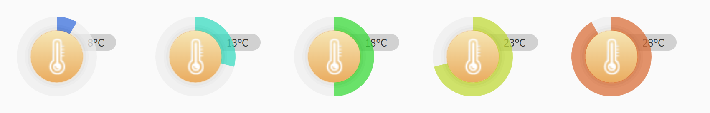

**Bedienung**

- Am Ring **ziehen** stellt die Solltemperatur ein. Sie wird beim Loslassen geschrieben.
- **Tippen** auf den Ring oder den Knopf öffnet die [Grafik](#gemeinsame-einstellungen-der-runden-widgets), wenn eine
  *URL* eingetragen ist.
- Solange der Ring nur beim Überfahren erscheint, blendet die Mitte die Messwerte aus, damit sie ihn nicht verdecken.
  Mit *Kreis immer zeigen* ist beides sichtbar, und der Ring zeigt keine Zahl.
- Das Widget verwendet immer den *Normal*-Stil. Es hat keinen An/Aus-Zustand.

| Einstellung | Attribut | Standard | Beschreibung |
|---|---|---|---|
| Objekt-ID | `oid` | | Die Solltemperatur, z. B. `level.temperature`. |
| Ist ID | `oid-actual` | | Gemessene Temperatur, wird in der Mitte angezeigt. |
| Luftfeuchtigkeit ID | `oid-humidity` | | Luftfeuchtigkeit, wird in der Mitte angezeigt. |
| Ventil ID | `oid-drive` | | Ventilstellung, wird rechts angezeigt. |
| Ventil nur An/Aus | `valveBinary` | aus | Für Ventile, die nur auf- oder zugehen: zeigt *auf* / *zu* statt Prozent. |
| Ventil ist von 0 bis 1 | `valve1` | aus | Für Ventile, die 0...1 statt 0...100 melden: der Wert wird mit 100 multipliziert. |
| Batterie-Objekt-ID | `oid-battery` | | Siehe [Indikatoren](#indikatoren). |
| Nur lesend | `readOnly` | aus | Zeigt den Ring, ändert die Solltemperatur aber nicht. |
| Einheit | `unit` | `°C` | Wird an die Temperaturen angehängt. |
| Minimum / Maximum | `min` / `max` | 6 / 30 | Bereich der Solltemperatur. |
| Nachkommastellen | `digits` | 0 | Nachkommastellen. Mit 1 erscheint `21,5`. |
| Schritt | `step` | 1 | Schrittweite des Rings, z. B. 0.5. |
| Komma als Dezimaltrennzeichen | `is_comma` | an | `21,5` statt `21.5`. |

Gruppen *Zentrum* (Standardbild `img/Heating.png`, Bildbreite 45), *Beschreibungen* (ohne rechten Text), *Stil* (nur
*Normal*, Standard `hq-button-base-intemp`) und *Grafik*: siehe [Allgemeines](#allgemeines).

Das Zahnrad des [Indikators "in Arbeit"](#indikatoren) erscheint, solange das Thermostat die neue Solltemperatur noch
nicht bestätigt hat.

## Außentemperatur - `tplHqOutTemp`

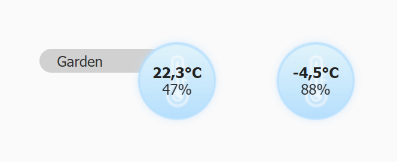

Zeigt eine Temperatur und eine Luftfeuchtigkeit. Es gibt weder Solltemperatur noch Ring. Ein Klick öffnet die Grafik,
wenn eine *URL* eingetragen ist.

| Einstellung | Attribut | Standard | Beschreibung |
|---|---|---|---|
| Ist ID | `oid-actual` | | Temperatur. |
| Luftfeuchtigkeit ID | `oid-humidity` | | Luftfeuchtigkeit. |
| Batterie-Objekt-ID | `oid-battery` | | Siehe [Indikatoren](#indikatoren). |
| Einheit | `unit` | `°C` | Wird an die Temperatur angehängt. |
| Nachkommastellen | `digits` | 0 | Nachkommastellen. |
| Komma als Dezimaltrennzeichen | `is_comma` | an | `22,3` statt `22.3`. |

Gruppen *Zentrum* (Standardbild `img/Heating.png`), *Beschreibungen*, *Stil* (nur *Normal*, Standard
`hq-button-base-outtemp`) und *Grafik*: siehe [Allgemeines](#allgemeines). Das Widget hat keinen Haupt-Datenpunkt,
deshalb wirken die Einstellungen zur Zeit der letzten Änderung hier nicht.

## Fenster und Rollladen - `tplHqShutter`

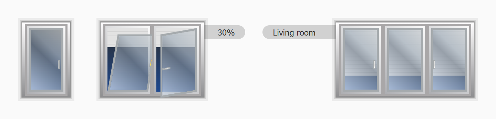

Ein Fenster mit bis zu sechs Flügeln und einem Rollladen. Jeder Flügel zeigt, ob er zu, gekippt oder offen ist, und
der Rollladen zeigt seine Position. Im Bild: ein geschlossener Flügel, zwei Flügel (gekippt und offen) mit der Position
rechts, und drei Flügel mit einer Beschreibung links.

Ein Klick auf das Fenster öffnet ein Bedien-Popup:

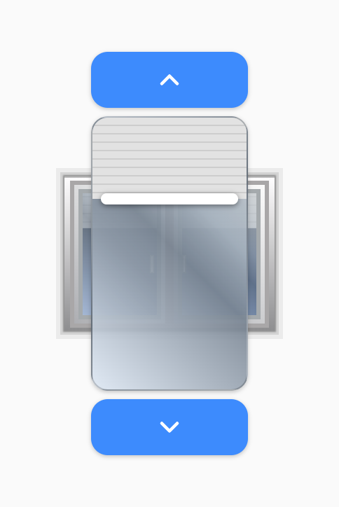

- **Pfeil nach oben** öffnet den Rollladen, **Pfeil nach unten** schließt ihn.
- Mit dem **Schieberegler** stellen Sie eine Position ein. Sie wird beim Loslassen geschrieben.
- Das Popup schließt sich nach einem Knopfdruck, nach *Timeout für Ausblenden* ohne Bedienung oder mit einem Klick
  irgendwo anders in der View. Im Editor gibt es kein Popup.

**Position und Richtung.** Ohne *Invertieren* bedeutet *Minimum* ganz offen und *Maximum* ganz geschlossen (der
Rollladen ist unten). Viele Geräte und die ioBroker-Rolle `level.blind` zählen umgekehrt (100 % = offen). Für diese
schalten Sie **Invertieren** ein.

| Einstellung | Attribut | Standard | Beschreibung |
|---|---|---|---|
| Objekt-ID | `oid` | | Position des Rollladens, z. B. `level.blind`. Ohne sie zeigt das Widget nur das Fenster. |
| Objekt-ID "in Arbeit" | `oid-working` | | Bleibt für vis-1-Projekte erhalten. Das Fenster zeigt keinen Indikator "in Arbeit" (vis-1 auch nicht). |
| Minimum / Maximum | `min` / `max` | 0 / 100 | Wertebereich des Datenpunkts. |
| Rahmenbreite | `border_width` | 3 | Breite des Fensterrahmens in px. |
| Flügelanzahl | `slide_count` | 1 | Anzahl der Flügel, 1...6. Für jeden Flügel gibt es eine Gruppe *Flügel* (siehe unten). |
| Invertieren | `invert` | aus | Einschalten, wenn das Gerät 100 % = offen meldet. |
| Timeout für Ausblenden | `hide_timeout` | 2000 | Zeit in ms, nach der sich das Popup von selbst schließt. 0: bleibt offen. |
| Keine Animation | `noAnimate` | aus | Der Rollladen springt auf die neue Position, statt zu fahren. |
| Rahmenfarbe | `frameColor` | | Farbe von Rahmen und Flügeln. Leer behält das Standardgrau. |
| Horizontale PopUp Position | `popupHorizontalPos` | mittig | Wo das Popup senkrecht erscheint: `top` (oben) - über dem Widget, an dessen Unterkante ausgerichtet; `bottom` (unten) - darunter, an der Oberkante ausgerichtet; `center` (mittig). |
| Vertikale PopUp Position | `popupVerticalPos` | mittig | Wo das Popup waagerecht erscheint: `left` (links) - links, an der rechten Kante ausgerichtet; `right` (rechts) - rechts, an der linken Kante ausgerichtet; `center` (mittig). |

Die Namen der beiden Positionen wirken vertauscht. Sie stammen aus vis-1 und wurden beibehalten, damit bestehende
Projekte weiter funktionieren.

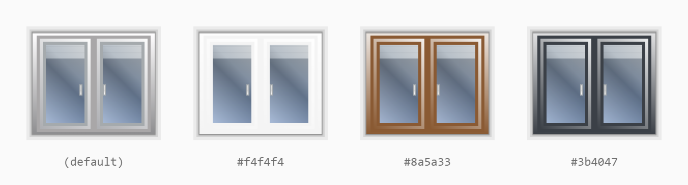

**Gruppe "Beschreibungen"**: *Keine Beschreibung (links)*, *Beschreibung (links)*, Schriftgrößen, Farben und
Abstände wie unter [Beschreibungen](#beschreibungen). Statt eines rechten Textes gibt es:

| Einstellung | Attribut | Standard | Beschreibung |
|---|---|---|---|
| Wert anzeigen | `show_value` | aus | Zeigt rechts die Position des Rollladens: 0 % = offen, 100 % = geschlossen. |

**Gruppe "Flügel"** - einmal pro Flügel (die Attributnamen enden mit der Nummer des Flügels, z. B. `slide_type1`):

| Einstellung | Attribut | Beschreibung |
|---|---|---|
| Flügeltyp | `slide_type` | Wie der Flügel öffnet. Leer: feste Scheibe ohne Griff. `left` / `right` (links / rechts): Scharnier links / rechts, Griff auf der anderen Seite. `top` / `bottom` (oben / unten): Griff oben / unten. |
| Fensterblatt-Sensor | `oid-slide-sensor` | Kontakt des Flügels: `true`, `1`, `open`, `opened` = offen; `2`, `tilt`, `tilted` = gekippt; alles andere = zu. |
| FB-Sensor lowbat | `oid-slide-sensor-lowbat` | Schwache Batterie dieses Kontakts - rotes Batteriesymbol. |
| Griff-Sensor | `oid-slide-handle` | Fenstergriff-Sensor: `0` = zu, `1` = gekippt, `2` = offen (wie der HomeMatic-Drehgriffkontakt). |
| Griff-Sensor lowbat | `oid-slide-handle-lowbat` | Schwache Batterie des Griff-Sensors - pinkes Batteriesymbol. |

Mit nur einem Griff-Sensor folgt der Flügel dem Griff. Mit nur einem Kontakt folgt der Griff dem Kontakt. Mit beiden
bestimmt der Kontakt den Flügel und der Griff-Sensor den Griff. Steht der Griff auf gekippt, wird auch der Flügel
gekippt gezeichnet. Ein gekippter Griff ist gelb.

Alle Kombinationen aus Typ und Griffstellung:

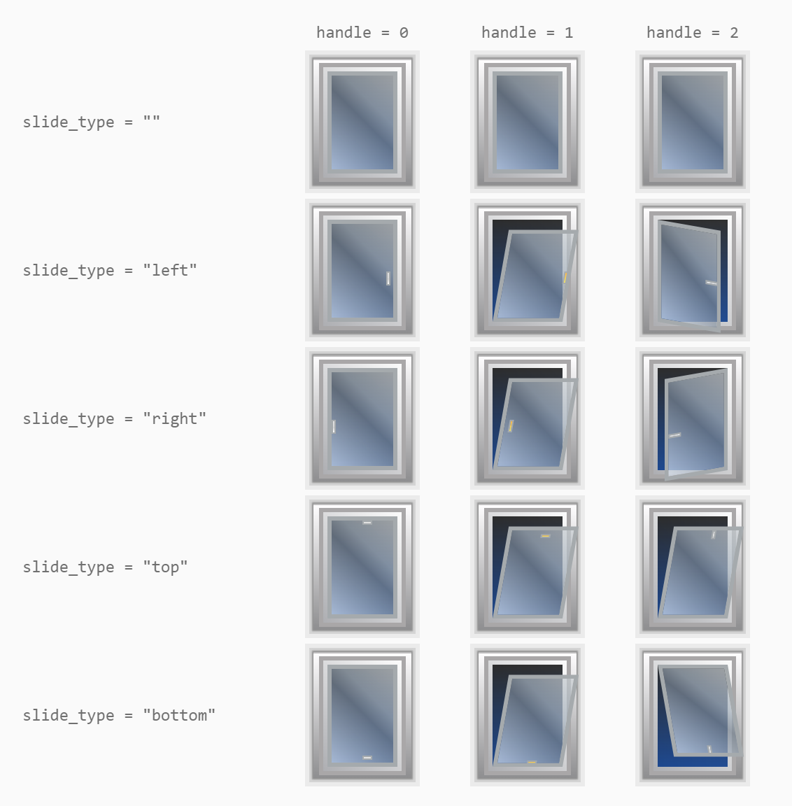

## Tür - `tplHqDoor`

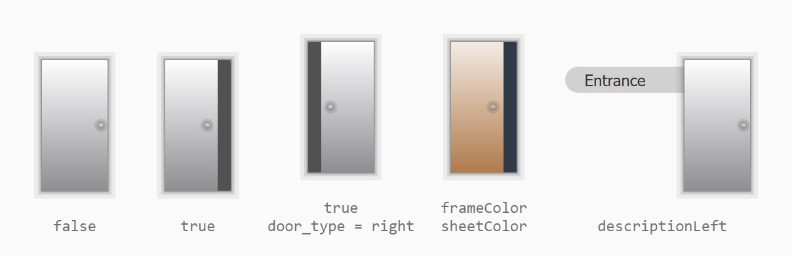

Eine Tür, die ihren Kontakt anzeigt: geschlossen, oder offen mit einem Spalt auf der Seite des Schlosses. Nur Anzeige,
das Widget reagiert nicht auf Klicks. Im Bild: geschlossen, offen, offen mit `door_type = right`, eigene Farben und eine
Beschreibung links.

| Einstellung | Attribut | Standard | Beschreibung |
|---|---|---|---|
| Objekt-ID | `oid` | | Türkontakt. `true`, `"true"` und Zahlen ungleich 0 bedeuten offen. |
| Batterie-Objekt-ID | `oid-battery` | | Siehe [Indikatoren](#indikatoren). |
| Signal-Objekt-ID | `oid-signal` | | Siehe [Indikatoren](#indikatoren). |
| Rahmenbreite | `border_width` | 3 | Breite des Türrahmens in px. |
| Invertieren | `invert` | aus | Für Kontakte, die im geschlossenen Zustand `true` melden. |
| Türtyp | `door_type` | (links) | Leer oder `left` (links): Scharnier links, der Spalt öffnet sich rechts. `right` (rechts): Scharnier rechts, der Spalt öffnet sich links. |
| Keine Animation | `noAnimate` | aus | Die Tür springt, statt zu schwingen. |
| Farbe der Türöffnung | `emptyColor` | `#515151` | Farbe des Spalts der offenen Tür. |
| Rahmenfarbe | `frameColor` | | Farbe des Rahmens. Leer behält das Standardgrau. |
| Farbe des Türblatts | `sheetColor` | | Farbe von Türblatt und Klinke. Leer behält den Standard. |

Gruppe *Beschreibungen*: nur links, siehe [Beschreibungen](#beschreibungen).

## Schloss - `tplHqLock`

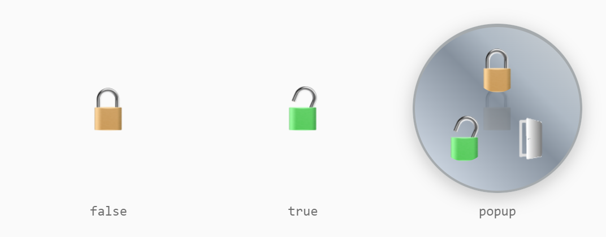

Ein Türschloss. Das Widget zeigt ein geschlossenes oder ein offenes Vorhängeschloss. Ein Klick öffnet ein rundes
Popup mit bis zu drei Knöpfen: **abschließen** (oben), **aufschließen** (unten links) und, wenn *Objekt-ID Aufmachen*
gesetzt ist, **Tür öffnen** (unten rechts). Das Popup schließt sich nach einem Knopfdruck, nach dem *Popup-Timeout*
oder mit einem Klick irgendwo anders in der View.

Das Schloss gilt nur dann als **offen**, wenn der Datenpunkt gleich dem *Schloss Auf-Wert* ist. Jeder andere Wert
gilt als abgeschlossen.

| Einstellung | Attribut | Standard | Beschreibung |
|---|---|---|---|
| Objekt-ID | `oid` | | Zustand des Schlosses, z. B. `switch.lock`. |
| Objekt-ID Aufmachen | `oid-open` | | Datenpunkt, der die Tür öffnet (die Falle). Ohne ihn hat das Popup nur zwei Knöpfe. |
| Batterie-Objekt-ID | `oid-battery` | | Siehe [Indikatoren](#indikatoren). |
| Keine Animation | `noAnimate` | aus | Das Popup erscheint, ohne aufzuzoomen. |

**Gruppe "Bilder"**

| Einstellung | Attribut | Standard | Beschreibung |
|---|---|---|---|
| Bild für Zu | `closedIcon` | `widgets/hqwidgets/img/lockLocked.png` | Bild des Widgets im abgeschlossenen Zustand. |
| Bild für Auf | `openedIcon` | `widgets/hqwidgets/img/lockUnlocked.png` | Bild des Widgets im offenen Zustand. |

**Gruppe "Popup"**

| Einstellung | Attribut | Standard | Beschreibung |
|---|---|---|---|
| Popup-Radius | `popupRadius` | 75 | Radius des Popups in px. |
| Knopf-Radius | `buttonRadius` | 50 | Eckenradius der drei Knöpfe. |
| Zu-Bild / Zu-Wert / Zu-Stil | `closeIcon` / `closeValue` / `closeStyle` | Schloss zu / `false` / | Knopf **abschließen**: Bild, Wert für die *Objekt-ID* und Stil (siehe [Stile](#stile-und-änderungseffekte)). |
| Schloss Auf-Bild / -Wert / -Stil | `openIcon` / `openValue` / `openStyle` | Schloss auf / `true` / | Knopf **aufschließen**. Der Wert entscheidet auch, wann das Widget als offen gilt. |
| Tür Auf-Bild / -Wert / -Stil | `openDoorIcon` / `openDoorValue` / `openDoorStyle` | Tür / `true` / | Knopf **Tür öffnen**, schreibt in *Objekt-ID Aufmachen*. |
| Popup-Timeout | `showTimeout` | 5000 | Zeit in ms, nach der sich das Popup von selbst schließt. 0: bleibt offen. |

Gruppe *Beschreibungen*: nur links, siehe [Beschreibungen](#beschreibungen). Gruppe *Stil* (Standard
`hq-button-no-background` für beide Zustände): siehe [Stile und Änderungseffekte](#stile-und-änderungseffekte).
*Normal* ist der abgeschlossene Zustand, *Aktiv* der offene. Der Änderungseffekt läuft bei jeder Änderung des
Schlosses.

## Schalter - `tplHqCheckbox`

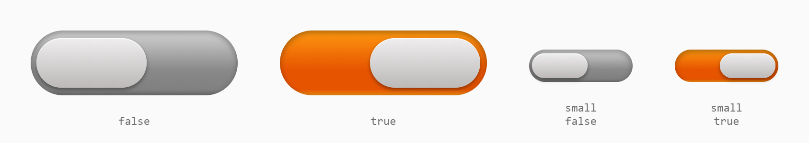

Ein Schiebeschalter. Ein Klick schaltet um und schreibt den *An-Wert* oder den *Aus-Wert*. Der Schalter hat eine feste
Größe: 216 x 68 px, mit der Größe `small` (klein) 108 x 34 px. Er wird im Widget zentriert.

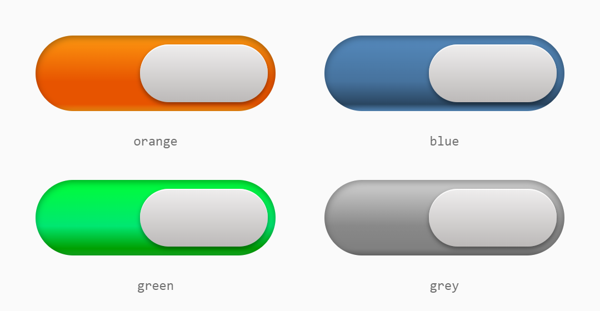

| Einstellung | Attribut | Standard | Beschreibung |
|---|---|---|---|
| Objekt-ID | `oid` | | Der Datenpunkt, der geschaltet wird. |
| Aus-Wert | `val_false` | `false` | Wird beim Ausschalten geschrieben. |
| An-Wert | `val_true` | `true` | Wird beim Einschalten geschrieben. Der Schalter steht auf an, solange der Datenpunkt diesen Wert hat. Ist der Wert `true`, zählt auch jede Zahl über 0 als an. |
| Statischer Wert | `staticValue` | | Nur ohne *Objekt-ID*: der Schalter zeigt nur diesen Wert an, zum Beispiel einen festen Zustand. |
| Nur lesend | `readOnly` | aus | Nur Anzeige. |
| Größe | `checkboxSize` | groß | `big` (groß, 216 x 68) oder `small` (klein, 108 x 34). |
| Farbe bei AUS | `checkboxColor` | grau | `orange`, `blue` (blau), `green` (grün) oder `grey` (grau). |
| Farbe bei AN | `checkboxColorOn` | orange | `orange`, `blue` (blau), `green` (grün) oder `grey` (grau). |

## Drehregler - `tplHqCircle`

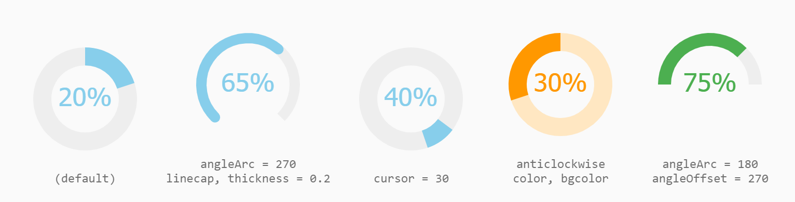

Ein runder Regler für eine beliebige Zahl, zum Beispiel eine Lautstärke oder eine Position. Er füllt das Widget aus,
die kürzere Seite bestimmt die Größe. Am Ring **ziehen** stellt den Wert ein. Er wird beim Loslassen geschrieben. Der
Ring lässt sich kürzen und drehen. Im Bild: der Standard, ein 270°-Ring mit runden Enden, ein Griff statt eines
Balkens, ein Ring gegen den Uhrzeigersinn in anderen Farben und ein Halbring.

| Einstellung | Attribut | Standard | Beschreibung |
|---|---|---|---|
| Objekt-ID | `oid` | | Der Wert. Ohne sie zeigt der Regler nur das *Minimum*. |
| Objekt-ID "in Arbeit" / Batterie- / Signal-Objekt-ID | `oid-working` / `oid-battery` / `oid-signal` | | Siehe [Indikatoren](#indikatoren). |
| Einheit | `unit` | | Wird an die Zahl angehängt. |
| Minimum / Maximum | `min` / `max` | 0 / 100 | Wertebereich. |
| Nachkommastellen | `digits` | 0 | Nachkommastellen der Zahl. |
| Schritt | `step` | 1 | Schrittweite. |
| Komma als Dezimaltrennzeichen | `is_comma` | an | `42,5` statt `42.5`. |
| Nur lesend | `readOnly` | aus | Nur Anzeige. |
| Beschriftung | `caption` | | Text unter der Zahl. |
| Nummer ausblenden | `hideNumber` | aus | Blendet die Zahl in der Mitte aus. |
| Winkeloffset | `angleOffset` | | Drehung der Skala in Grad, 0 = beginnt oben. Leer: ein gekürzter Ring hat seine Lücke unten. |
| Bogenwinkel | `angleArc` | 360 | Länge der Skala in Grad, z. B. 270 für einen unten offenen Ring. |
| Letzten Wert zeigen | `displayPrevious` | an | Zeigt beim Ziehen den aktuellen Wert als blassen Balken. |
| Griff | `cursor` | | Statt eines Balkens vom Anfang an zeichnet der Regler nur ein kurzes Stück beim Wert. Die Zahl bestimmt seine Länge. |
| Dicke | `thickness` | 0.35 | Breite des Rings als Anteil des Radius. |
| Farbe | `color` | `#87CEEB` | Farbe von Balken und Zahl. |
| Hintergrundfarbe | `bgcolor` | | Farbe der Spur. Leer folgt dem Design. |
| Linienende | `linecap` | aus | Runde Enden des Balkens. |
| Gegenuhrzeigersinn | `anticlockwise` | aus | Die Skala läuft gegen den Uhrzeigersinn. |

## Zählwerk - `tplHqOdometer`

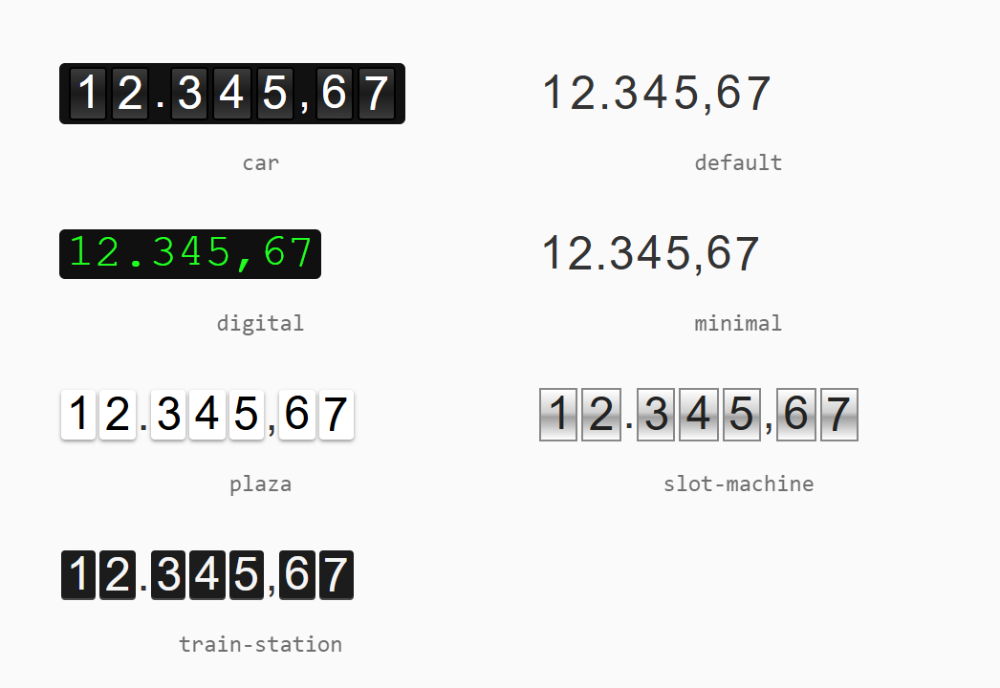

Ein mechanisches Zählwerk, zum Beispiel für Strom-, Gas- oder Wasserzähler. Ändert sich der Wert, rollen die Ziffern
zum neuen Wert. Die Größe der Ziffern folgt der Schriftgröße des Widgets (Standard 24 px). Nur Anzeige.

| Einstellung | Attribut | Standard | Beschreibung |
|---|---|---|---|
| Objekt-ID | `oid` | | Ein Datenpunkt mit einer Zahl. |
| Thema | `style` | car | Aussehen des Zählwerks: `car`, `default`, `digital`, `minimal`, `plaza`, `slot-machine`, `train-station` (siehe Bild). |
| Format | `format` | `(ddd),dd` | `d` steht für eine Ziffer. Der Teil in Klammern wiederholt sich samt Trennzeichen über den ganzzahligen Teil. Danach folgen das Dezimaltrennzeichen und ein `d` pro Nachkommastelle. Beispiele für 12345.67: `(.ddd),dd` → `12.345,67`, `(,ddd).dd` → `12,345.67`, `(ddd)` → `12346`. |
| Faktor | `factor` | 1 | Der Wert wird damit multipliziert, z. B. 0.001, um Wh als kWh anzuzeigen. |
| Führende Nullen | `leadingZeros` | an | Füllt den ganzzahligen Teil bis zur Gruppenbreite mit Nullen auf, z. B. `005`. |
| Animationsdauer (ms) | `duration` | 3000 | Wie lange die Ziffern rollen. |

## Unterschiede zu vis-1

Die vis-2-Widgets verwenden kein jQuery, jQuery UI, `jquery.knob` oder `odometer.js`. Projekte werden unverändert
übernommen. Einige Details verhalten sich anders:

- **Schalter:** die Größe `small` ändert nicht mehr die Größe des Widgets. Der Schalter wird stattdessen im Widget
  zentriert.
- **Grafik-Dialog:** der jQuery-UI-Einblendeffekt (`dialog_effect`) entfällt, und der Dialog hat keine Titelzeile.
- **Temperatur-Ring:** die Farbe läuft von Blau nach Rot. In vis-1 lief sie in der Mitte über Violett.
- **An/Aus:** *Wert für AN* / *Wert für AUS* der zusätzlichen Steuerung werden jetzt verwendet. vis-1 hat sie
  ignoriert.
- **Neue Einstellungen:** *Nur lesend* bei Dimmer, Innentemperatur und Drehregler. Signal und Farbe der Türöffnung bei
  der Tür. Indikatoren beim Drehregler. Animationsdauer beim Zählwerk. Rahmen- und Türblattfarben bei Fenster und Tür.
- **Popups:** die Popups von Fenster und Schloss schließen sich mit einem Klick irgendwo anders in der View.
